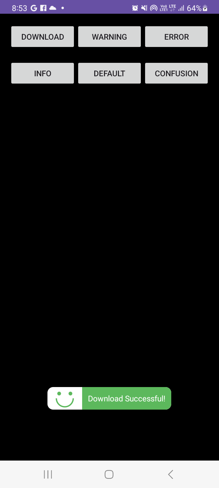
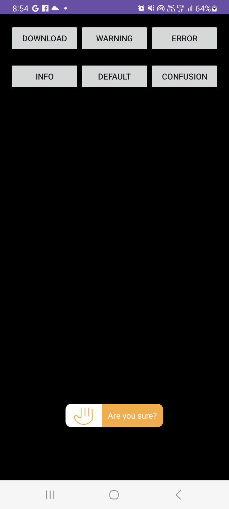
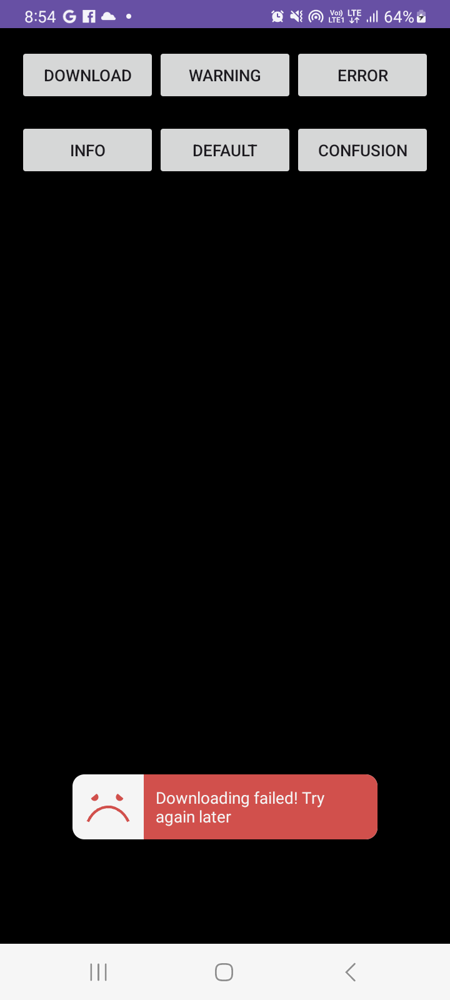
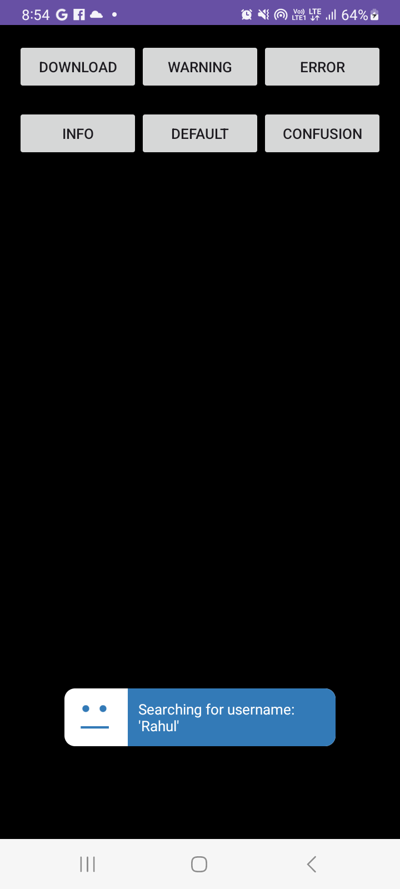
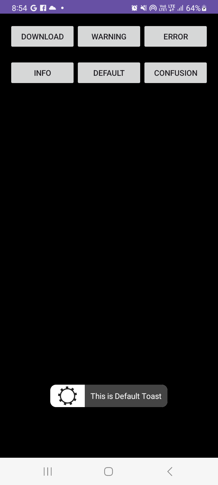
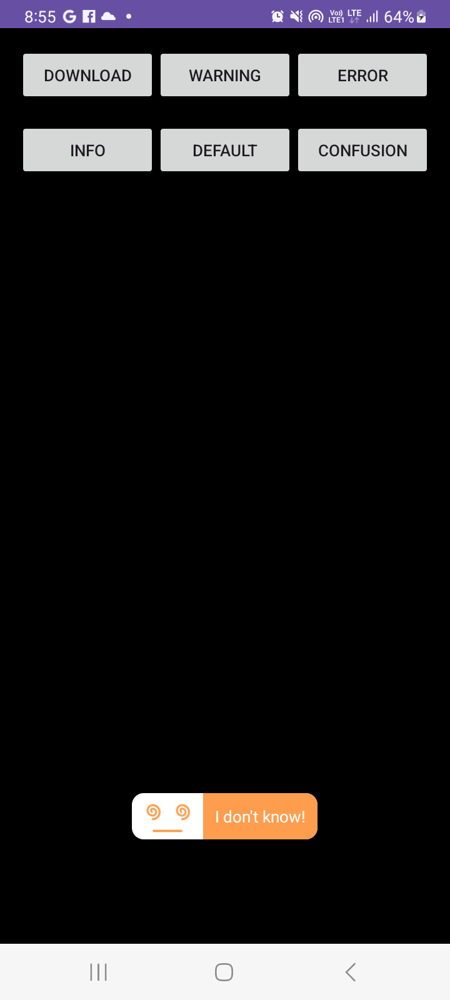

# TastyToast Library

TastyToast is a customizable and visually appealing Android library for creating different types of Toast messages with minimal effort.


## Features

- **Success Toast**
- **Warning Toast**
- **Error Toast**
- **Info Toast**
- **Default Toast**
- **Confusing Toast**

- ## Screenshots


|                                |                                |
|:-------------------------:|:-------------------------:|
|  |   |
|  |   |
|  |   |


## Getting Started

### Installation


 Add the JitPack repository to your build file 
  ```groovy
  allprojects {
		repositories {
			
			maven { url 'https://jitpack.io' }
			
		}
	}
  ```

Add the following dependency in your `build.gradle` file:

```groovy
implementation ("com.github.samyak2403:TastyToasts:1.0.2")
```

### Usage

To use TastyToast, call the `TastyToast.makeText` method in your activity or fragment. Below are examples of different toast types you can create:

```kotlin
// Success Toast
TastyToast.makeText(context, "Download Successful!", TastyToast.LENGTH_LONG, TastyToast.SUCCESS)

// Warning Toast
TastyToast.makeText(context, "Are you sure?", TastyToast.LENGTH_LONG, TastyToast.WARNING)

// Error Toast
TastyToast.makeText(context, "Downloading failed! Try again later", TastyToast.LENGTH_LONG, TastyToast.ERROR)

// Info Toast
TastyToast.makeText(context, "Searching for username: 'Rahul'", TastyToast.LENGTH_LONG, TastyToast.INFO)

// Default Toast
TastyToast.makeText(context, "This is Default Toast", TastyToast.LENGTH_LONG, TastyToast.DEFAULT
)

// Confusing Toast
TastyToast.makeText(context, "I don't know!", TastyToast.LENGTH_LONG, TastyToast.CONFUSING)
```

### Toast Types

- **SUCCESS**: Displays a success message with a green icon.
- **WARNING**: Displays a warning message with an orange icon.
- **ERROR**: Displays an error message with a red icon.
- **INFO**: Displays an informational message with a blue icon.
- **DEFAULT**: Displays a default message with no specific styling.
- **CONFUSING**: Displays a confusing message with a purple icon.


Include screenshots showcasing each toast type to help users visualize them.

## License

This project is licensed under the MIT License - see the [LICENSE](LICENSE) file for details.

## Author

Created by [Samyak Kamble](https://github.com/samyak2403).
